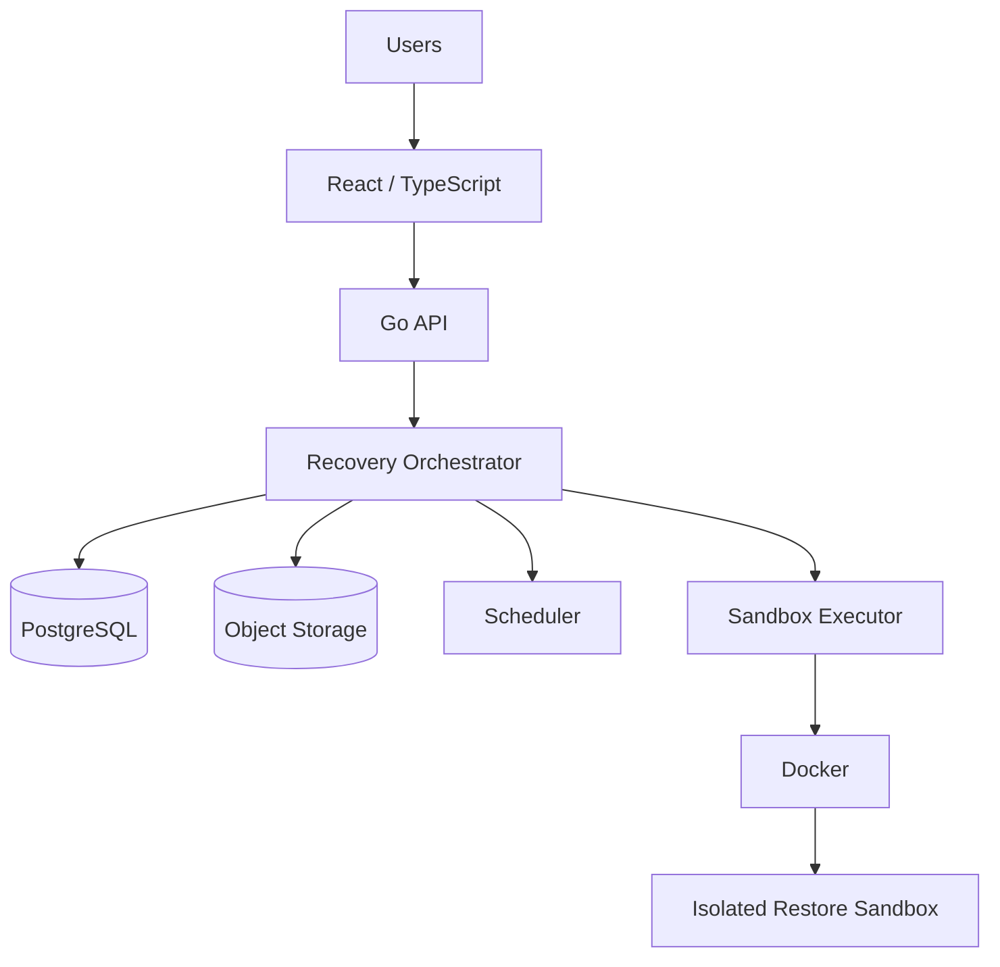
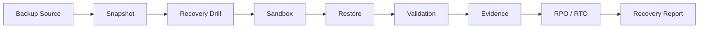

# RestoreGuard

[](https://github.com/thiagomontozo/restoreguard/actions/workflows/ci.yml)
[](https://github.com/thiagomontozo/restoreguard/actions/workflows/codeql.yml)
[](LICENSE)

RestoreGuard verifies that backups can actually be restored by running controlled recovery drills, validating recovered systems, measuring RPO/RTO, and preserving recovery evidence.

> **Current status: Experimental.** RestoreGuard is not production-ready, compliance-certified, or a guarantee of disaster recovery. A successful controlled drill demonstrates only the tested conditions.

**A successful backup job is not the same as a verified recovery.** RestoreGuard sits above backup tools and answers a different question: *the backup exists, but can it really be restored?*

## What problem does RestoreGuard solve?

Backup products are good at creating and retaining recovery points. Their “completed successfully” signal does not prove that an artifact is readable, that it can initialize a clean system, that application data is coherent, or that recovery meets business RPO/RTO targets. RestoreGuard orchestrates a disposable recovery environment and records what was actually observed.

RestoreGuard follows a deliberately simple principle:

```text
Discover → Restore → Validate → Measure → Prove
```

It complements Veeam, Restic, Borg, pgBackRest, AWS Backup, database-native dumps, and snapshot systems. It does not pretend to replace them and v0.1 does not claim adapters that are not implemented.

## Key features

- Organization-scoped protected assets, backup sources, snapshots, recovery policies, drills, evidence, reports, users, and audit events.
- Local filesystem and S3-compatible object-storage adapters with streaming SHA-256 and hard size limits; MinIO is used for development and integration tests.
- PostgreSQL-first recovery workflow for plain SQL dumps, with a real synthetic restore E2E and controlled corrupted-backup failure test.
- Typed validation engine: file existence/size/SHA-256, PostgreSQL connectivity/table/row profiles, and sandbox-restricted HTTP health foundations.
- Docker sandbox executor with allowlisted images, internal networks, resource/PID limits, read-only root filesystem, unique labels, timeouts, cancellation, and compensating cleanup.
- Explicit RPO (recovery-point age) and RTO (drill start through required validation completion) measurements.
- Separate technical drill status, recovery assessment, policy results, and qualitative confidence explanation.
- Cookie sessions with Argon2id passwords, CSRF protection, restrictive CORS, backend RBAC, session revocation, and password change.
- Limited worker pool, database-advisory-lock scheduler, persisted drill steps, SSE progress, audit events, and private PDF reports.
- React/TypeScript/Vite interface focused on operational recovery readiness rather than a “magic score.”

## Architecture

RestoreGuard is a modular monolith. The control plane can later delegate execution to a remote runner without changing domain semantics.





Read [architecture.md](docs/architecture.md), [domain-model.md](docs/domain-model.md), and the [ADRs](docs/adr/) for decisions and boundaries.

## Recovery drill lifecycle

```text
QUEUED → PREPARING → RESTORING → VALIDATING → FINALIZING
                                              ├→ SUCCEEDED
                                              ├→ FAILED
                                              ├→ INCONCLUSIVE
                                              └→ CANCELLED
```

Impossible transitions are rejected in the domain layer. `SUCCEEDED` describes execution; the separate assessment is `VERIFIED`, `PARTIALLY_VERIFIED`, `FAILED`, or `INCONCLUSIVE`. Missing metadata never becomes `PASS`.

## Recovery Assurance vs Backup

| Backup system answers | RestoreGuard answers |
|---|---|
| Was a backup job run? | Was a controlled restore actually completed? |
| Is an artifact retained? | Is the selected artifact readable and internally valid? |
| What is the configured frequency? | What was the measured recovery-point age (RPO)? |
| What retention applies? | How long did tested recovery take (RTO)? |
| What did the backup product report? | What validation evidence was observed in the sandbox? |

## Quick start

Requirements: Docker Desktop with Linux containers and Docker Compose. No host PostgreSQL or Node installation is required.

```powershell
git clone https://github.com/thiagomontozo/restoreguard
Set-Location restoreguard
Copy-Item .env.example .env
docker compose up -d --build
docker compose ps
```

Open `http://localhost:55173`. The Compose-only development bootstrap is `admin@restoreguard.local` / `restoreguard-demo-password`; change it immediately and never reuse it. The committed values are isolated development credentials, not production secrets.

The API is exposed at `http://localhost:58080`, PostgreSQL at `127.0.0.1:55432`, MinIO API at `127.0.0.1:59000`, and MinIO Console at `127.0.0.1:59001`.

Stop and remove the development data:

```powershell
./scripts/cleanup.ps1
```

## Docker development

`compose.yml` provides PostgreSQL, MinIO, the Go backend, and the React frontend. The development backend mounts the Docker socket so it can create restore sandboxes. **Docker socket access is equivalent to highly privileged control of the Docker host.** It must not be exposed to the frontend or untrusted tenants. See [sandbox-executor.md](docs/sandbox-executor.md) and [threat-model.md](docs/threat-model.md).

Production deployments should pin images by digest, use an isolated runner boundary, supply all secrets externally, enable HTTPS/secure cookies, and avoid co-locating an Internet-facing control plane with a Docker socket.

## Testing

```powershell
./scripts/test.ps1       # unit + PostgreSQL/MinIO integration + frontend checks
./scripts/e2e.ps1        # real synthetic PostgreSQL backup/restore/failure flow
```

The E2E creates only synthetic `customers`, `orders`, and `products` data. It removes the source after `pg_dump`, restores into a different PostgreSQL container on an internal network, validates tables and rows, writes evidence metadata, measures RPO/RTO, and destroys every sandbox resource. See [testing.md](docs/testing.md).

## Security model

Backup artifacts are untrusted input. RestoreGuard applies allowlisted images, typed restore steps, size/time/resource limits, path-safe storage keys, streaming hashes, isolated restore destinations, restrictive sessions/CORS/CSRF, tenant-scoped queries, and audit logs. It never offers remote shell, arbitrary Docker arguments, arbitrary mounts, arbitrary images, or a command textbox.

Integrity metadata can help detect unintended artifact changes. It is not “tamper proof,” forensically certified, or a legal-admissibility claim. Reports are authorization-protected and do not use permanent public URLs.

## Current limitations

- Docker is the only sandbox executor.
- PostgreSQL is the primary fully validated database recovery workflow.
- Local filesystem and S3-compatible sources are available; no Veeam, Restic, Borg, pgBackRest, or cloud-snapshot restoration adapter is implemented yet.
- No remote execution agent or Kubernetes executor.
- TOTP schema/foundation exists, but enrollment and recovery UX are not implemented.
- Local AES-256-GCM secret encryption depends on an externally supplied master key; no HSM/Vault adapter is included.
- The in-process worker/scheduler model targets a single control-plane deployment; the scheduler uses a database advisory lock.
- No production-scale load or decompression-bomb validation; archives are not extracted on the host.

See [limitations.md](docs/limitations.md) for the full honest boundary.

## Roadmap

- **v0.1 — Recovery Assurance Core:** PostgreSQL, local/S3 sources, Docker sandbox, validations, RPO/RTO, evidence, reports.
- **v0.2 — Backup Ecosystem:** Restic, pgBackRest, more databases, richer notifications.
- **v0.3 — Enterprise Recovery:** remote restore runner, Veeam adapter, cloud snapshots, distributed workers, advanced secret stores.
- **v0.4 — Infrastructure Assurance Integration:** optional NetScope/InfraGraph integration.

The roadmap is intent, not a promise or an implemented feature list. See [roadmap.md](docs/roadmap.md).

## Contributing

Read [CONTRIBUTING.md](CONTRIBUTING.md). Security issues must follow [SECURITY.md](SECURITY.md), not a public issue.

## License

MIT © 2026 Thiago Montozo. See [LICENSE](LICENSE).


# RestoreGuard

[](https://github.com/thiagomontozo/restoreguard/actions/workflows/ci.yml)
[](https://github.com/thiagomontozo/restoreguard/actions/workflows/codeql.yml)
[](LICENSE)

RestoreGuard verifies that backups can actually be restored by running controlled recovery drills, validating recovered systems, measuring RPO/RTO, and preserving recovery evidence.

> **Current status: Experimental.** RestoreGuard is not production-ready, compliance-certified, or a guarantee of disaster recovery. A successful controlled drill demonstrates only the tested conditions.

**A successful backup job is not the same as a verified recovery.** RestoreGuard sits above backup tools and answers a different question: *the backup exists, but can it really be restored?*

## What problem does RestoreGuard solve?

Backup products are good at creating and retaining recovery points. Their “completed successfully” signal does not prove that an artifact is readable, that it can initialize a clean system, that application data is coherent, or that recovery meets business RPO/RTO targets. RestoreGuard orchestrates a disposable recovery environment and records what was actually observed.

RestoreGuard follows a deliberately simple principle:

```text
Discover → Restore → Validate → Measure → Prove
```

It complements Veeam, Restic, Borg, pgBackRest, AWS Backup, database-native dumps, and snapshot systems. It does not pretend to replace them and v0.1 does not claim adapters that are not implemented.

## Key features

- Organization-scoped protected assets, backup sources, snapshots, recovery policies, drills, evidence, reports, users, and audit events.
- Local filesystem and S3-compatible object-storage adapters with streaming SHA-256 and hard size limits; MinIO is used for development and integration tests.
- PostgreSQL-first recovery workflow for plain SQL dumps, with a real synthetic restore E2E and controlled corrupted-backup failure test.
- Typed validation engine: file existence/size/SHA-256, PostgreSQL connectivity/table/row profiles, and sandbox-restricted HTTP health foundations.
- Docker sandbox executor with allowlisted images, internal networks, resource/PID limits, read-only root filesystem, unique labels, timeouts, cancellation, and compensating cleanup.
- Explicit RPO (recovery-point age) and RTO (drill start through required validation completion) measurements.
- Separate technical drill status, recovery assessment, policy results, and qualitative confidence explanation.
- Cookie sessions with Argon2id passwords, CSRF protection, restrictive CORS, backend RBAC, session revocation, and password change.
- Limited worker pool, database-advisory-lock scheduler, persisted drill steps, SSE progress, audit events, and private PDF reports.
- React/TypeScript/Vite interface focused on operational recovery readiness rather than a “magic score.”

## Architecture

RestoreGuard is a modular monolith. The control plane can later delegate execution to a remote runner without changing domain semantics.


Read [architecture.md](docs/architecture.md), [domain-model.md](docs/domain-model.md), and the [ADRs](docs/adr/) for decisions and boundaries.

## Recovery drill lifecycle

```text
QUEUED → PREPARING → RESTORING → VALIDATING → FINALIZING
                                              ├→ SUCCEEDED
                                              ├→ FAILED
                                              ├→ INCONCLUSIVE
                                              └→ CANCELLED
```

Impossible transitions are rejected in the domain layer. `SUCCEEDED` describes execution; the separate assessment is `VERIFIED`, `PARTIALLY_VERIFIED`, `FAILED`, or `INCONCLUSIVE`. Missing metadata never becomes `PASS`.

## Recovery Assurance vs Backup

| Backup system answers | RestoreGuard answers |
|---|---|
| Was a backup job run? | Was a controlled restore actually completed? |
| Is an artifact retained? | Is the selected artifact readable and internally valid? |
| What is the configured frequency? | What was the measured recovery-point age (RPO)? |
| What retention applies? | How long did tested recovery take (RTO)? |
| What did the backup product report? | What validation evidence was observed in the sandbox? |

## Quick start

Requirements: Docker Desktop with Linux containers and Docker Compose. No host PostgreSQL or Node installation is required.

```powershell
git clone https://github.com/thiagomontozo/restoreguard
Set-Location restoreguard
Copy-Item .env.example .env
docker compose up -d --build
docker compose ps
```

Open `http://localhost:55173`. The Compose-only development bootstrap is `admin@restoreguard.local` / `restoreguard-demo-password`; change it immediately and never reuse it. The committed values are isolated development credentials, not production secrets.

The API is exposed at `http://localhost:58080`, PostgreSQL at `127.0.0.1:55432`, MinIO API at `127.0.0.1:59000`, and MinIO Console at `127.0.0.1:59001`.

Stop and remove the development data:

```powershell
./scripts/cleanup.ps1
```

## Docker development

`compose.yml` provides PostgreSQL, MinIO, the Go backend, and the React frontend. The development backend mounts the Docker socket so it can create restore sandboxes. **Docker socket access is equivalent to highly privileged control of the Docker host.** It must not be exposed to the frontend or untrusted tenants. See [sandbox-executor.md](docs/sandbox-executor.md) and [threat-model.md](docs/threat-model.md).

Production deployments should pin images by digest, use an isolated runner boundary, supply all secrets externally, enable HTTPS/secure cookies, and avoid co-locating an Internet-facing control plane with a Docker socket.

## Testing

```powershell
./scripts/test.ps1       # unit + PostgreSQL/MinIO integration + frontend checks
./scripts/e2e.ps1        # real synthetic PostgreSQL backup/restore/failure flow
```

The E2E creates only synthetic `customers`, `orders`, and `products` data. It removes the source after `pg_dump`, restores into a different PostgreSQL container on an internal network, validates tables and rows, writes evidence metadata, measures RPO/RTO, and destroys every sandbox resource. See [testing.md](docs/testing.md).

## Security model

Backup artifacts are untrusted input. RestoreGuard applies allowlisted images, typed restore steps, size/time/resource limits, path-safe storage keys, streaming hashes, isolated restore destinations, restrictive sessions/CORS/CSRF, tenant-scoped queries, and audit logs. It never offers remote shell, arbitrary Docker arguments, arbitrary mounts, arbitrary images, or a command textbox.

Integrity metadata can help detect unintended artifact changes. It is not “tamper proof,” forensically certified, or a legal-admissibility claim. Reports are authorization-protected and do not use permanent public URLs.

## Current limitations

- Docker is the only sandbox executor.
- PostgreSQL is the primary fully validated database recovery workflow.
- Local filesystem and S3-compatible sources are available; no Veeam, Restic, Borg, pgBackRest, or cloud-snapshot restoration adapter is implemented yet.
- No remote execution agent or Kubernetes executor.
- TOTP schema/foundation exists, but enrollment and recovery UX are not implemented.
- Local AES-256-GCM secret encryption depends on an externally supplied master key; no HSM/Vault adapter is included.
- The in-process worker/scheduler model targets a single control-plane deployment; the scheduler uses a database advisory lock.
- No production-scale load or decompression-bomb validation; archives are not extracted on the host.

See [limitations.md](docs/limitations.md) for the full honest boundary.

## Roadmap

- **v0.1 — Recovery Assurance Core:** PostgreSQL, local/S3 sources, Docker sandbox, validations, RPO/RTO, evidence, reports.
- **v0.2 — Backup Ecosystem:** Restic, pgBackRest, more databases, richer notifications.
- **v0.3 — Enterprise Recovery:** remote restore runner, Veeam adapter, cloud snapshots, distributed workers, advanced secret stores.
- **v0.4 — Infrastructure Assurance Integration:** optional NetScope/InfraGraph integration.

The roadmap is intent, not a promise or an implemented feature list. See [roadmap.md](docs/roadmap.md).

## Contributing

Read [CONTRIBUTING.md](CONTRIBUTING.md). Security issues must follow [SECURITY.md](SECURITY.md), not a public issue.

## License

MIT © 2026 Thiago Montozo. See [LICENSE](LICENSE).
