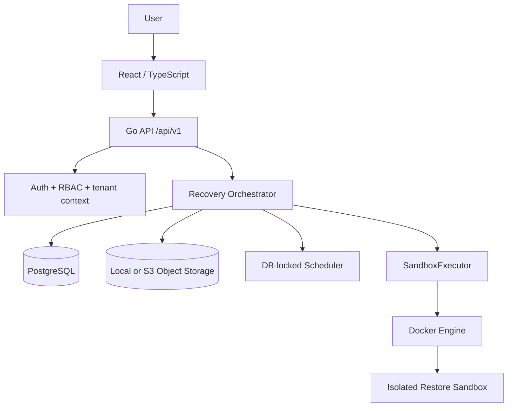

# Architecture

RestoreGuard is a modular monolith with one Go control-plane process and a separate React application. Domain rules do not depend on HTTP, PostgreSQL, S3, or Docker packages. Adapters implement persistence, artifact storage, discovery, and sandbox execution. This keeps v0.1 deployable while preserving boundaries for a future remote runner.

The control network contains the API, PostgreSQL, and object storage. Each drill gets unique Docker resources and an internal restore network. Sandboxes do not join the control network. The UI never receives Docker parameters and never accesses the Docker socket.

The worker pool is bounded by `RESTOREGUARD_MAX_CONCURRENT_DRILLS`. `context.Context` propagates shutdown, timeout, and cancellation. Each state transition and timeline step is persisted. Evidence/report writes use idempotent constraints and compensating deletion when an object write cannot be committed with PostgreSQL metadata.

The Docker socket is a v0.1 deployment risk, not a security boundary. The intended evolution is a separate, mutually authenticated Sandbox Runner Agent with narrowly scoped typed operations.
