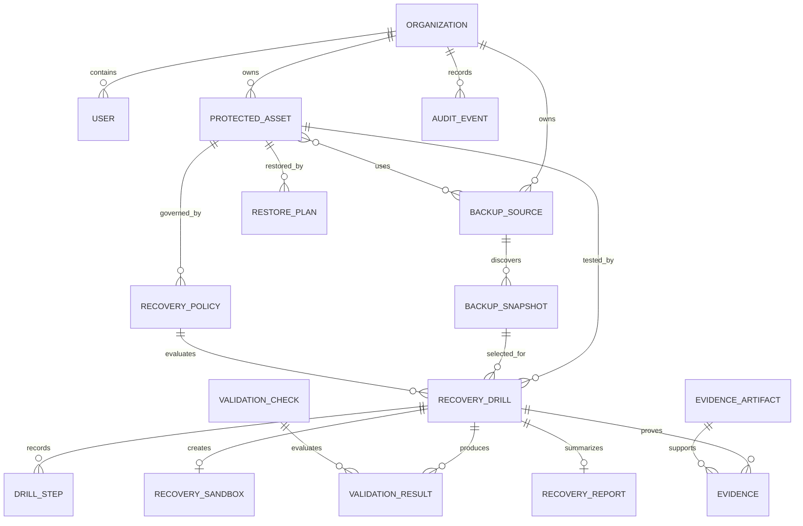

# Domain model

The central aggregate is `RecoveryDrill`. A protected asset can use several backup sources; discovery upserts source-scoped external snapshot IDs. A policy supplies RPO/RTO targets, schedule, required validations, and retention. A restore plan contains typed steps only.

Every important row is organization-scoped. The organization comes from the authenticated session, never from a browser-provided organization ID. `DrillStatus` describes orchestration; `RecoveryAssessment` describes evidence quality. Policy results are independent so a restore can pass while RPO or RTO fails.
