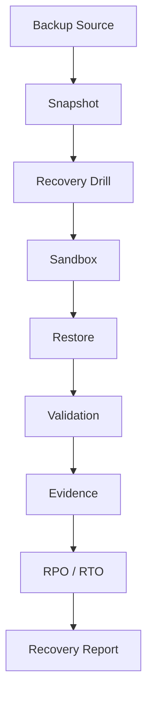

# Recovery drills

The lifecycle is `QUEUED → PREPARING → RESTORING → VALIDATING → FINALIZING`, followed by `SUCCEEDED`, `FAILED`, `CANCELLED`, or `INCONCLUSIVE`. The domain state machine rejects skips and terminal-state mutation. `drill_steps` persists ordered timestamps, summary, status, and a safe failure code; logs are not the timeline source.

Cancellation propagates through context, stops subsequent work, and triggers sandbox cleanup. Partial evidence may remain only when clearly marked partial. Retry-safe unique keys prevent duplicate drill creation, evidence types, reports, sandboxes, and finalization.

Technical errors use stable codes such as `BACKUP_NOT_FOUND`, `BACKUP_CHECKSUM_MISMATCH`, `SANDBOX_CREATE_FAILED`, `SANDBOX_TIMEOUT`, `RESTORE_FAILED`, `VALIDATION_FAILED`, `ARTIFACT_STORAGE_FAILED`, `CANCELLED`, and `INTERNAL_ERROR`. Missing evidence is `INCONCLUSIVE`, not `PASS`.
